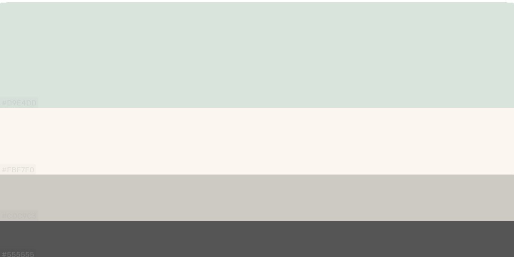
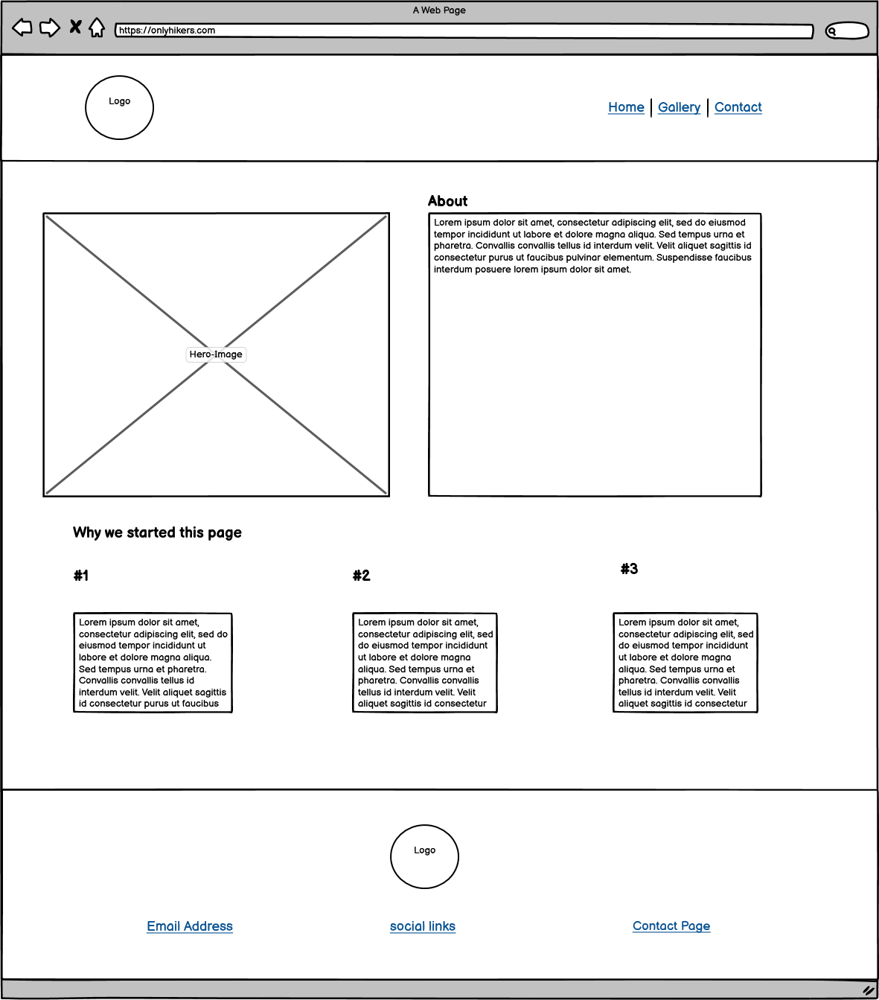
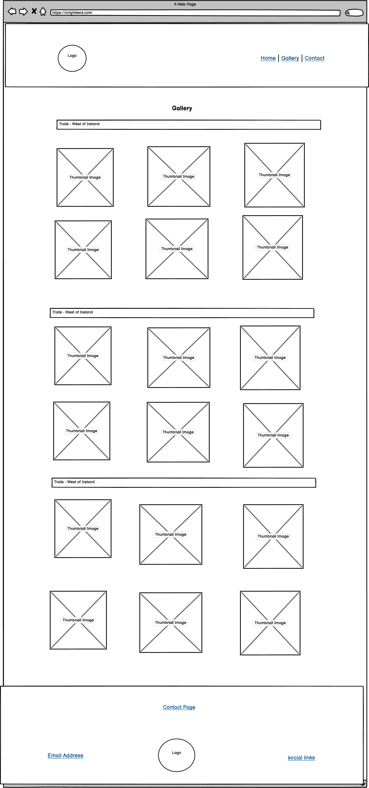
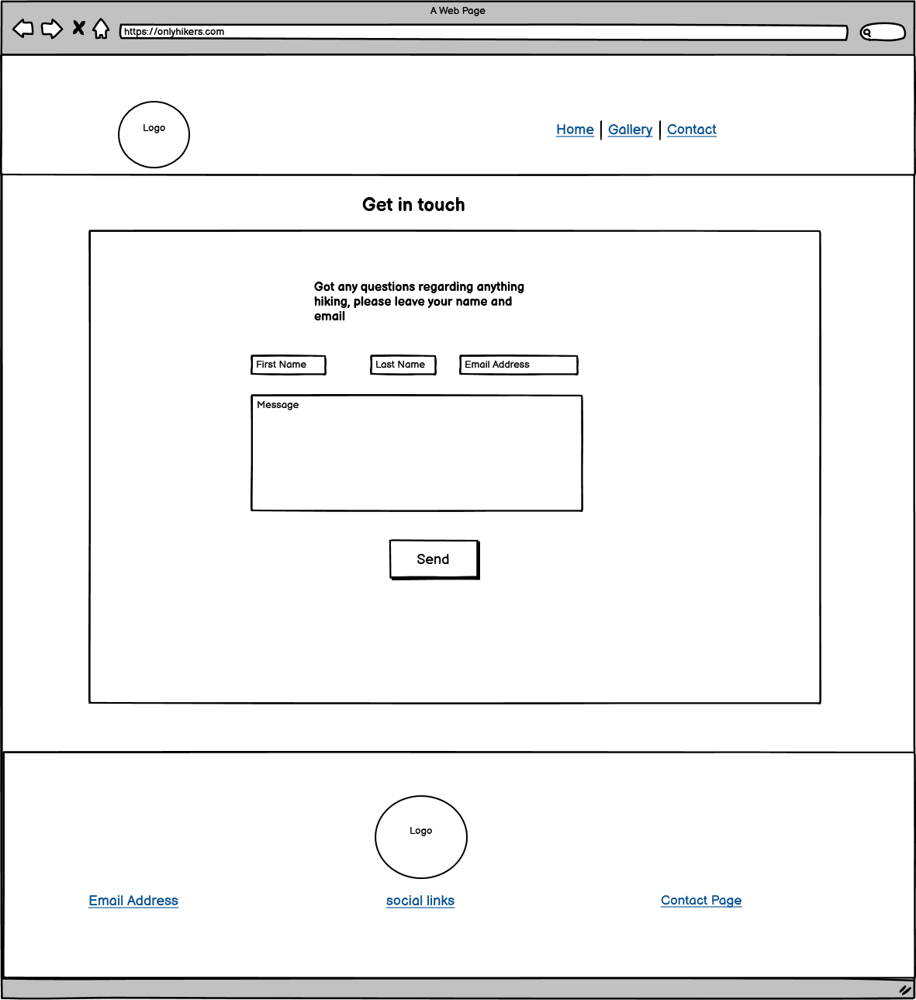
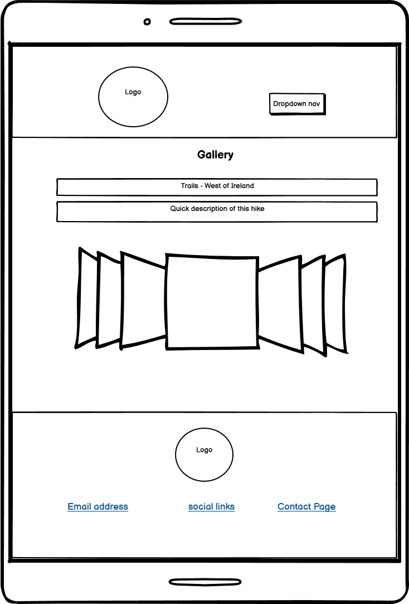
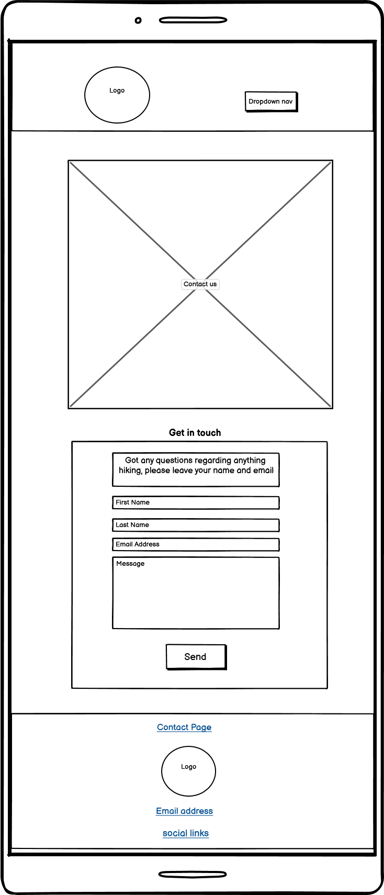

## Table of Contents:

* [Project Overview](#project-overview)
* [User Experience](#user-experience)
    * [User Stories](#user-stories)
    * [Design](#design)
        * [1. Font](#1-font)
        * [2. Color Scheme](#2-color-scheme)
        * [3. Logo](#3-logo)
        * [4. Wireframing](#5-wireframing)
* [Technology Used](#technology-used)
* [Features](#features)
* [Testing](#testing)
* [Deployment](#deployment)
* [Credits](#credits)
    * [Special Thanks & Acknowledgements](#special-thanks--acknowledgements)

***

# Project Title

##  Only Hikers     

***

This milestone project is my first ever solo coding project where I aim to showcase the skills learnt thus far.
This project is a static front-end site built using HTML and CSS in conjunction with the Bootstrap Framework to create a responsive, mobile-first webpage.

Travel and hiking have always been two huge passions of mine so the idea for this project came about throughout lockdown this year when I was restricted 
from travelling anywhere overseas. I began to explore and discover hikes and trails in Ireland that are some of the most beauitful I have seen. It was 
definitely an escape from the craziness that has been going on in the world.  
After all these hikes, I had so many beautiful photos of Ireland and nowhere to showcase them. A picture is worth a thousand words, right?

My goal for this site is . 
I want to and .

 
## User Experience

#### Project Goals

- To build a fully responsive website across all devices 
- To create an easy-to-use website that is easy to navigate
- To inspire users through images of breathtaking scenery to get out and explore our beauitful country
- To share my experiences with my users 
- To connect with like-minded individuals who share the same passions and might teach me a thing or two
 
#### User Stories

* As a user, I want a website that is easy to navigate so I can access all of the information without any challenges
* As a user who is new to hiking, I want to be able to find a contact form quickly in order to get in touch with all my questions
* As a user who enjoys the great outdoors, I want lots of visually pleasing images that capture the beauty of Ireland
* As a user living in Ireland, I want ideas for my next hiking getaway 
* As a user who tends to use their mobile more than desktop, I want a webpage that is fully responsive across all devices 

Use this section to provide insight into your UX process, focusing on who this website is for, what it is that they want to achieve and how your project is the best way to help them achieve these things.

In particular, as part of this section we recommend that you provide a list of User Stories, with the following general structure:
- As a user type, I want to perform an action, so that I can achieve a goal.

This section is also where you would share links to any wireframes, mockups, diagrams etc. that you created as part of the design process. These files should themselves either be included as a pdf file in the project itself (in an separate directory), or just hosted elsewhere online and can be in any format that is viewable inside the browser.

## Design
### 1. Font
I used <a href="https://fontpair.co/">Font Pair</a> to choose the two main fonts for my website which are
 <a href="https://fonts.google.com/specimen/Roboto">'Roboto'</a> and <a href="https://fonts.google.com/specimen/Nunito"> 'Nunito'.</a>
 I'll use Roboto for the headings of the site and Nunito for the body, both of which are very easy to read.

### 2. Color Scheme
I used <a href="https://colorhunt.co/palette/">Color Hunt</a> to pick the colors for my website. I wanted to pick earthy tones to tie in with the concept of hiking and nature. 
The colors are as follows from top to bottom:

 - #D9E4DD
 - #FBF7F0  
 - #CDC9C3
 - #555555

<h1 align="left">
    
</h1>

I used #282626 for my headings across the jumbotron as #555555 didn't create enough of a contrast against the image of the sea and sky.

### 3. Logo

I used <a href="https://www.freelogodesign.org/">Free Logo Design</a> , a free website to make my logo for my website. 
I entered the name of the site, "Only Hikers", and then selected the "Environmental & Green" category which gave me a 
multitude of logos to choose from. I chose the logo that I found most visually pleasing and also one with a transparent 
background so it could fit into any header color of my choosing.

<h1 align="left">
    
</h1>

### 4. Wireframing

I used <a href="https://balsamiq.com/">Balsamiq</a> to create rough wireframes for my project in order to plan out the layout of the webpage on both desktop and mobile devices.
* Large device Wireframe for Home Page
<h1 align="center">
    
</h1>

* Large device Wireframe for Gallery Page
<h1 align="center">
    
</h1>

* Large device Wireframe for Contact Page
<h1 align="center">
    
</h1>

* Mobile device Wireframe for Home Page
<h1 align="center">
    
</h1>

* Mobile device Wireframe for Gallery Page
<h1 align="center">
    
</h1>

* Mobile device Wireframe for Contact Page
<h1 align="center">
    
</h1>

## Features

This project consists of three different pages.

### Features found on all three:
- Headers are fixed across all devices and contain the logo with an anchor tag to the home page and the navbar has anchor tags to their corresponding pages. 
- Headers on mobile devices contain the navbar in the form of a hamburger menu to use the screen space more efficiently.
- Footers across all devices contain the sites logo with an anchor tag to the home page with all relevant social media icons linked to the relevant sites. Footer also has a link to the contact page.

### Features unique to Home Page:
- Large image to set the tone for the site
- Text area with brief introduction
- Three images/icons to grab attention with short text area of reasons to hike

### Features unique to Gallery Page:
- Using Bootstrap Framework to create a photo Carousel to showcase photos from various different hikes

### Features unique to Contact Page:
- Form with four different inputs, namely 'First Name', 'Last Name', 'Email Address' and 'Message'
- Submit button that users hit once they have input required data

 
### Features Left to Implement
- Another feature idea

## Technologies Used

### Languages Used

- [HTML5](https://en.wikipedia.org/wiki/HTML5) - I used HTML as the main language for structuring the content
- [CSS3](https://en.wikipedia.org/wiki/CSS) - I used CSS as the primary language for styling the sites content

### Frameworks, Libraries & Programs Used

- Bootstrap
- Font Awesome
- Balsamiq
- Google Fonts
- Color Hunt
- GitHub
- Git
- Free Logo Design
- Font Pair

For each, provide its name, a link to its official site and a short sentence of why it was used.

- [JQuery](https://jquery.com)
    - The project uses **JQuery** to simplify DOM manipulation.

## Testing

In this section, you need to convince the assessor that you have conducted enough testing to legitimately believe that the site works well. Essentially, in this part you will want to go over all of your user stories from the UX section and ensure that they all work as intended, with the project providing an easy and straightforward way for the users to achieve their goals.

Whenever it is feasible, prefer to automate your tests, and if you've done so, provide a brief explanation of your approach, link to the test file(s) and explain how to run them.

For any scenarios that have not been automated, test the user stories manually and provide as much detail as is relevant. A particularly useful form for describing your testing process is via scenarios, such as:

1. Contact form:
    1. Go to the "Contact Us" page
    2. Try to submit the empty form and verify that an error message about the required fields appears
    3. Try to submit the form with an invalid email address and verify that a relevant error message appears
    4. Try to submit the form with all inputs valid and verify that a success message appears.

In addition, you should mention in this section how your project looks and works on different browsers and screen sizes.

You should also mention in this section any interesting bugs or problems you discovered during your testing, even if you haven't addressed them yet.

If this section grows too long, you may want to split it off into a separate file and link to it from here.

## Deployment

This section should describe the process you went through to deploy the project to a hosting platform (e.g. GitHub Pages or Heroku).

In particular, you should provide all details of the differences between the deployed version and the development version, if any, including:
- Different values for environment variables (Heroku Config Vars)?
- Different configuration files?
- Separate git branch?

In addition, if it is not obvious, you should also describe how to run your code locally.

## Credits

### Content
- The text for section Y was copied from the [Wikipedia article Z](https://en.wikipedia.org/wiki/Z)

### Media
- The photos used in this site were obtained from ...

### Acknowledgements

- I received inspiration for this project from X

