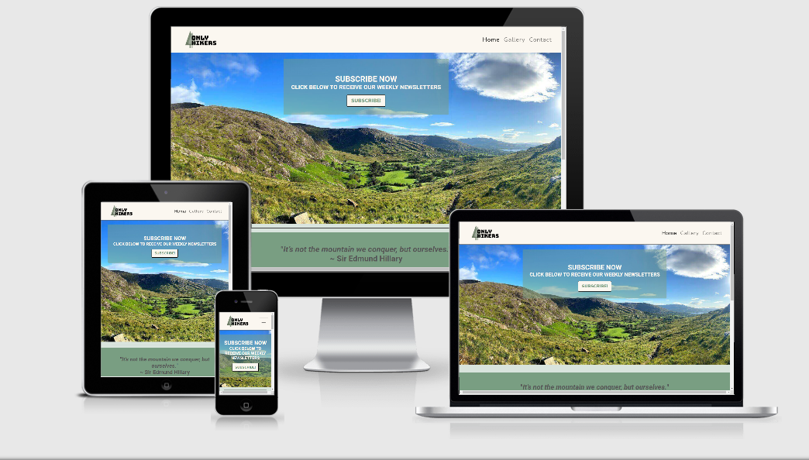
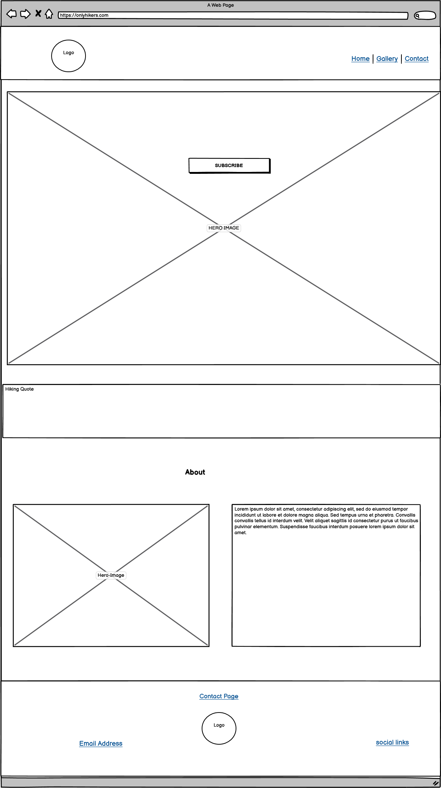
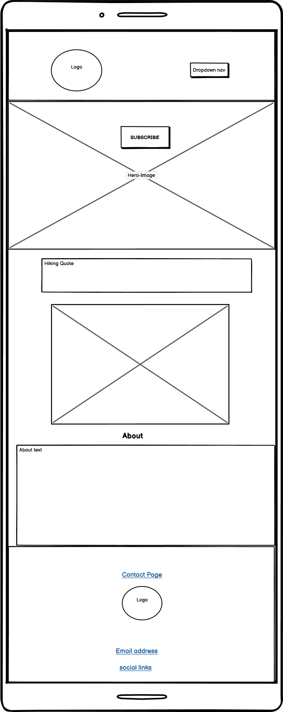
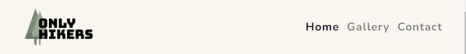
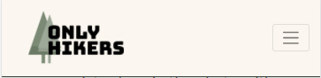
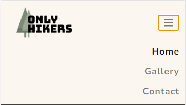
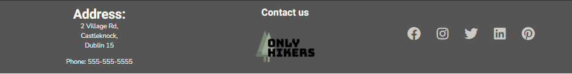
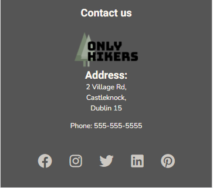
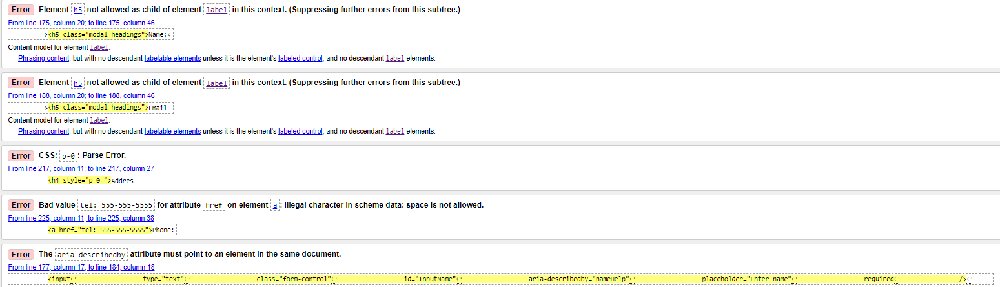

## Table of Contents :

* [Project Overview](#project-overview)
* [User Experience](#user-experience)
    * [Project Goals](#project-goals)
    * [User Stories](#user-stories)
    * [Design](#design)
        * [1. Font](#1-font)
        * [2. Color Scheme](#2-color-scheme)
        * [3. Logo](#3-logo)
        * [4. Wireframing](#5-wireframing)
* [Features](#features)
    * [Existing Features](#existing-features)
    * [Features Left to Implement](#features-left-to-implement)
* [Technology Used](#technology-used)
    * [Languages Used](#languages-used)
    * [Frameworks Libraries & Programs Used](#frameworks-libraries-and-programs-used)
* [Testing](#testing)
    - [Responsivity across devices](#responsivity-across-devices)
    - [HTML and CSS Validator Tests](#html-and-css-validator-tests)]
    - [Test Cases](#navigation-links)
        - [Header]()
        - [Footer]()
        - [Home Page]()
        - [Gallery Page]()
        - [Contact Page]()
    - [Lighthouse Tool](#lighthouse-tool)
    - [Spell Check](#spell-check)
 * [Issues and Solutions](#issues-and-solutions)   
* [Deployment](#deployment)
    * [Initial Creation](#initial-creation)
    * [Deployment via GitHub](#deployment-via-github)
    * [Local Deployment](#local-deployment)
* [Credits](#credits)
    * [Content](#content)
    * [Media](#media)
    * [Acknowledgements](#acknowledgements)
    

***

# Project Overview

##  Only Hikers     

***

A live verson of my site can be found <a href="https://shielh.github.io/Only-Hikers-MS1/">here</a>.

This milestone project has been my first ever solo coding project where I aimed to showcase the skills learnt thus far.
This project is a static front-end site built using HTML and CSS in conjunction with the Bootstrap Framework to create a responsive, mobile-first approach webpage.

Travel and hiking have always been two huge passions of mine so the idea for this project came about throughout lockdown this year when I was restricted 
from travelling anywhere overseas. I began to explore and discover hikes and trails in Ireland that are some of the most beauitful I have ever seen. 
After all these hikes, I had so many beautiful photos of Ireland and nowhere to showcase them. A picture is worth a thousand words, right?

My goal for this site is to spread the word about hiking in Ireland and hopefully inspire people to get out and experience it for themselves.

## Responsive site

Using the website <a href="http://ami.responsivedesign.is/">Am I Responsive</a>, I got the below image showing what the site looks like across all devices.

 
## User Experience

#### Project Goals

- To build a fully responsive website across all devices 
- To create an easy-to-use website that is simple to navigate
- To set up the basic layout and content for this webpage which can be added to in the future
- To inspire users through images of breathtaking scenery to get out and explore our beauitful country
- To have a contact form where like-minded hiking individuals or people that are keen to start can get in touch  
 
#### User Stories

* As a user, I want a website that is easy to navigate so I can access all of the information without any challenges
* As a user who is new to hiking, I want to be able to find a contact form quickly in order to get in touch with any questions
* As a user who enjoys the great outdoors, I want lots of visually pleasing images that capture the beauty of Ireland
* As a user living in Ireland, I want ideas for my next hiking getaway 
* As a user who tends to use their mobile more than desktop, I want a webpage that is fully responsive across all devices 

## Design
### 1. Font
I used <a href="https://fontpair.co/">Font Pair</a> to choose the two main fonts for my website which are
 <a href="https://fonts.google.com/specimen/Roboto">'Roboto'</a> and <a href="https://fonts.google.com/specimen/Nunito"> 'Nunito'.</a>
 I'll use Roboto for the headings of the site and Nunito for the body, both of which are easy to read for the users.

### 2. Color Scheme
I used <a href="https://colorhunt.co/palette/">Color Hunt</a> to pick the colors for my website. I wanted to pick earthy tones to tie in with the concept of nature and hiking. 
The colors are as follows from top to bottom (as well as using #3f3f3c in some places where it provided more of a contrast than #555555):

 * #D9E4DD
 * #FBF7F0  
 * #CDC9C3
 * #555555

### 3. Logo

I used <a href="https://www.freelogodesign.org/">Free Logo Design</a> , a free website to make the logo for my website. 
I entered the name of the site, "Only Hikers", and then selected the "Environmental & Green" category which gave me a 
multitude of logos to choose from. I chose the logo that I found most visually pleasing and also one with a transparent 
background so it could fit into any header color of my choosing.

### 4. Wireframing

I used <a href="https://balsamiq.com/">Balsamiq</a> to create rough wireframes for my project in order to plan out the layout of the webpage on both desktop and mobile devices.
* Large device Wireframe for Home Page. Alternatively you can view the wireframe here : [Landing Page Desktop](assets/uxd/balsamiqWireframe/LandingPageDesktop.png)
 and [Landing Page Mobile](assets/uxd/balsamiqWireframe/LandingPageMobile.png)

* Large device Wireframe for Gallery Page. Alternatively you can view the wireframe here : [Gallery Page Desktop](assets/uxd/balsamiqWireframe/GalleryPageDesktop.png) 
and [Gallery Page Mobile](assets/uxd/balsamiqWireframe/GalleryPageMobile.png)

* Large device Wireframe for Contact Page. Alternatively you can view the wireframe here : [Contact Page Desktop](assets/uxd/balsamiqWireframe/GalleryPageDesktop.png) 
and [Contact Page Mobile](assets/uxd/balsamiqWireframe/ContactPageMobile.png)

## Features
### Existing Features
#### Features found on all three:
* Headers are sticky across all devices and contain the logo with an anchor tag to the home page and the navbar has anchor tags to their corresponding pages. 
* Headers on mobile devices contain the navbar in the form of a hamburger menu to use the screen space more efficiently.

See below the difference between desktop and mobile view:
 

 

 

* Footers across all devices contain the sites logo with an anchor tag to the home page and a link to the contact page .
On desktop view, social media icons are located on the right side of the footer and are linked to the relevant social media sites opening a new tab when clicked. 
The footer also contains the address and phone number of the website located on the left of the footer.

See below the difference between desktop and mobile view:
 

 

#### Features unique to Home Page:
- Large hero-image spanning across entire width of the page with a "Subscribe" modal button inside
- Modal contains a name input box, an email input box and a submit button
- A text area with a quote on hiking inside
- An image of the OnlyHikers page owners
- Text area with brief introduction on the owners and what the page is about

#### Features unique to Gallery Page:
- 6 thumbnail images for 3 different hikes, making a total of 18 images
- On mobile devices, all 18 images appear vertically with one per row to make the image a better size for the viewer
- On mobile devices, there is a link "click to top of page" to bring the user to the top of the page rather than scrolling the whole way up

#### Features unique to Contact Page:
- Large image under the navbar with text inside a jumbotron positioned inside
- Contact form with three different inputs, 'Name', 'Email Address' and 'Message' and a submit button underneath

 
### Features Left to Implement
- Events page where users can book into hikes as spaces will be limited due to health and safety
- Expand on gallery and implement bootstraps carousel component for a nice slideshow efficiently
- Introduce a blog page and enable commenting on blogs and gallery to better connect users and open up the site to discussions
- Set up the Back End script so that the subscription modal and contact form are sent for processing

## Technologies Used

### Languages Used

- [HTML5](https://en.wikipedia.org/wiki/HTML5) - I used HTML as the main language for structuring the content
- [CSS3](https://en.wikipedia.org/wiki/CSS) - I used CSS as the primary language for styling the sites content

### Frameworks Libraries and Programs Used

- [Bootstrap](https://getbootstrap.com/)  
Used to help in the design and layout of the website in conjunction with HTML and CSS
- [Font Awesome](https://fontawesome.com/)  
I used the icons from this site for the social media anchor tags in the footer
- [Balsamiq](https://balsamiq.com/)  
I used this to create my rough wireframes
- [Google Fonts](https://fonts.google.com/)  
I used Google Fonts to import my two fonts for this site, Roboto and Nunito
- [Color Hunt](https://colorhunt.co/) 
I found the palette of colours I would use for my site here
- [GitHub](https://github.com/)  
This is the hosting site where I first created the repository for this webpage and also where the live site is deployed from 
- [Git](https://git-scm.com/)  
This is the version control software used where can I commit and push the updated information to the hosting website GitHub
- [Free Logo Design](https://www.freelogodesign.org/)  
I created my free logo here for my site
- [Font Pair](https://fontpair.co/)  
I chose my two complementary fonts for my webpage here
- [Tiny JPG](https://tinyjpg.com/)  
I used this to compress my images
- [Paint 3D](https://www.microsoft.com/en-us/p/paint-3d/9nblggh5fv99?activetab=pivot:overviewtab)  
I used this progran to crop my site logo while still maintaing the clear background
- [Rapid Tables](https://www.rapidtables.com/convert/color/hex-to-rgb.html)
I used this to convert my dark green colour to rgb to use for the slightly transparent jumbotron and contact form background
- [Reverso](https://www.reverso.net/spell-checker/english-spelling-grammar/)
I used this to check the spelling and grammar of my README.md file

## Testing

The aim of this testing section is to:
1. Ensure that my site is fully responsive across all devices ranging from mobile (<576px) to large desktop screens (>1200px) and across different browsers including Chrome, Safari, Mozilla and Opera.  
2. Perform tests on the HTML and CSS code through their respective validators. 
3. Test each navigation link on the webpage to make sure it brings you to the correct page including social links
4. Test the modal subscription component to ensure it opens up the subscription form across all devices on index.html page
5. Ensure the form component on the Contact page is functioning properly requiring both inputs to be in the correct format before submit button will work
6. Check hovering over the site logo, nav-items in the header, "contact" and "gallery" in About Us section on index.html and site logo, "contact us", 
telephone number and social icons have the appropriate response
7. Run DevTools Lighthouse across all pages of the site in both mobile and desktop versions

*** 

### Responsivity across devices
- I checked the site across [Google Chrome](https://www.google.com/intl/en_ie/chrome/), [Mozilla Firefox](https://www.mozilla.org/en-US/firefox/new/), [Safari](https://www.apple.com/safari/) 
and [Opera](https://www.opera.com/) and all were completely responsive with all pages viewing with layout remaining intact.
- Using [Chrome DevTools](https://developers.google.com/web/tools/chrome-devtools), (to open I right-clicked anywhere on my website and clicked "Inspect"), I ran my site in mobile/tablet display 
across the following devices: Galaxy Note 3, Galaxy S III, Moto G4, iPhone 4, Galaxy S5, Pixel 2, Pixel 2 XL, iPhone 5/SE, iPhone 6/7/8, iPhone 6/7/8 Plus, iPhone X, iPad, iPad Pro. Everything 
ran normally on these devices.

***
 
### HTML and CSS Validator Tests
* W3C HTML Validator
    - I opened [W3C HTML Validator](https://validator.w3.org/) and selected the "Validate by Direct Input" option and pasted index.html, gallery.html and contact.html all in separately.
    - I removed the h5 elements as a child element of the label. I removed p-0 from the inline style for h4. I removed the space between the "tel:" and the "555" and finally I matched the aria-describedly 
with its appropriate ID element. 
    - I ran the code through [W3C HTML Validator](https://validator.w3.org/) again and got the following message "Document checking completed. No errors or warnings to show."
    
    All pages initally came up with the following errors:

* Similarly, I ran the code through the [W3C CSS Validator](https://jigsaw.w3.org/css-validator/) 
    - I selected the "by Direct Input" option 
    - I received the message "Congratulations! No Error Found." 

***

### Navigation links

#### Navigation links on all three pages
* Site logo 
    - Can be found at top left of navbar and in the center of the footer on each of the three pages
    - When clicked on any of the pages at either position (header and footer), it redirects to index.html page or stays on index.html if that is the page you clicked it on but it refreshes the page
* Home Nav Item
    - Visible on navbar across all three pages
    - Visible on mobile devices once you click the hambruger icon dropdown menu
    - Click it and it redirects you to index.html (except from index.html which will refresh page)
* Gallery Nav Item
    - Visible on navbar across all three pages
    - Visible on mobile devices once you click the hambruger icon dropdown menu
    - Click it and it redirects you to gallery.html (except from gallery.html which will refresh page)
* Contact Nav Item
    - Visible on navbar across all three pages
    - Visible on mobile devices once you click the hambruger icon dropdown menu
    - Click it and it redirects you to contact.html (except from contact.html which will refresh page)
* Phone Number anchor tag
    - Visible in the footer across mobile and desktop 
    - Click the phone number and it will promt you to pick and application to make the call on 
* Contact Us
    - Visible in the footer across mobile and desktop
    - Click it and it redirects you to contact.html (except from contact.html which will refresh page)
* Social Media links
    - Visible in the footer across mobile and desktop
    - Click each icon on each of the three pages
    - Social sites open in a new tab
    - Each social icon brings you to the correct social media site

#### Navigation links on index.html
* "contact us" in "ABOUT US" section
    - Go to index.html page
    - Scroll to "ABOUT US" section
    - Click the "contact us" text with a heavier font-weight than the surrounding text
    - It will redirect you to the contact.html page
* "gallery" in "ABOUT US" section
    - Go to index.html page
    - Scroll to "ABOUT US" section
    - Click the "gallery" text with a heavier font-weight than the surrounding text
    - It will redirect you to the gallery.html page

#### Navigation links on gallery.html
* "Click to top of page" link at the bottom of gallery.html page on mobile device
    - Go to gallery.html page
    - Scroll down the page to the bottom of the images
    - Click the link "Click to top of page"
    - You are brought to the top of the gallery.html page

***
 
### Modal Component
* Check modal component on desktop
    - Go to to index.html page
    - Click the "SUBSCRIBE!" button
    - Attempt to submit the empty form to confirm that an error message appears for the empty input box
    - Attempt to submit the form with an email missing the "@" symbol
    - Attempt to sumbit the form with all inputs correctly filled in to confirm page reloads once submitted
* Check modal component on mobile
    - Repeat the above steps on a mobile device

***

### Contact Form 
* Contact form on contact.html
    - Go to the contact.html page
    - Attempt to submit the empty form to confirm that an error message appears for the empty input box
    - Attempt to submit the form with an email missing the "@" symbol to confirm appropriate error message appears
    - Attempt to sumbit the form with all inputs correctly filled in to confirm page reloads once submitted

***

### Hover Transitions
* Test hover elements found across all three pages
    - Open the index.html, gallery.html and contact.html pages and test the following on each page:
        - In the header and footer, hover over the site logo to observe the logo enlarge
        - In the header, hover over the navbar items "Home", "Gallery" and "Contact" to observe each individually get bigger
        - In the footer, hover over the "Contact us" anchor tag and observe the colour change from #FBF7F0 to #799e82
        - In the footer, hover over the social media icons and observe both the icons grow and the colour change from #FBF7F0 to #799e82
        - In the footer, hover over the telepohone number and observe the colour change from #FBF7F0 to #799e82
* Test hover elements found on index.html and contact.html
    - Open the index.html and contact.html pages and test the following on each page:
        - Hover over the respective "SUBSCRIBE" and "SUBMIT button on each page and observe the button reverse font colour to background colour
* Test hover elements found on index.html
    - Open index.html
        - Hover over the "contact us" and "gallery" text in the "ABOUT US" section and observe the font colour change from #383737 to #799e82

***

### Lighthouse Tool
 
In Lighthouse, scores from 90-100(green) are considered good, scores from 50-89(orange) needs improvement and below 50(red) are considered poor. 

* On desktops:
    - Open each page, right-click and click "Inspect"
    - Click "Lighthouse" on the top right of the DevTools navbar
    - Ensure "Desktop" is ticked and click "Generate Report"
        - index.html: Scored 97 in "Performance", 94 in "Accessibility" and 100 in "Best Practises"
        - gallery.html: Scored 98 in "Performance", 97 in "Accessibility" and 100 in "Best Practises"
        - contact.html: Scored 99 in "Performance", 96 in "Accessibility" and 100 in "Best Practises"
* On mobile devices:
    - Open each page, right-click and click "Inspect"
    - Click "Lighthouse" on the top right of the DevTools navbar
    - Ensure "Mobile" is ticked and click "Generate Report"
        - index.html: Scored 83 in "Performance", 95 in "Accessibility" and 93 in "Best Practises"
        - gallery.html: Scored 95 in "Performance", 95 in "Accessibility" and 93 in "Best Practises"
        - contact.html: Scored 91 in "Performance", 96 in "Accessibility" and 93 in "Best Practises"

***

### Spell Check
* I used [Reverso](https://www.reverso.net/spell-checker/english-spelling-grammar/) to perform a spell check on my README.md

## Issues and Solutions
* My index.html Lighthouse score for performace was 83 which falls in the "needs improvement" category. I tried compressing the hero image further to 
help reduce the "Lowest Contentful Paint" time but it didn't make much of a difference. I tried resizing the image to have a mobile version and then 
used a media query to have a larger version of the image for desktop view. Again, this didn't make much of a difference however it did move the score up 
from 72 to 83. I made the decision to not waste any more time on this issue and to leave as is and to make note for future reference.
* Throughout the development, I came across a bug where lots of Pinterest icons were hidden in the background of the footer making the height of the 
footer much larger than it needed to be. I discover there was an unclosed "a tag" which was causing this issue.
* Another issue I faced was deviating from my original wireframes. You can see the original wireframes [here](assets/uxd/balsamiqWireframe/oldWireframes). I ended up adding a hero image 
and rejigging the layout of the site. I think because it was my first webpage I needed to play around with the layout a little before deciding on a concrete look for the website. I can 
see going forward though the benefits of having a set wireframe before starting any coding to save time.
* When styling my navbar the hamburger icon disappeared. The area was still functioning when I clicked it i.e. the dropdown menu was still working but I just couldn't see the icon. I realised this 
was due to me changing the style of the already predefined style that comes with "navbar-light". I had the option of using a Font Awesome icon and styling it in style.css or keep the navbar-light 
style. I opted to keep the navbar-light settings as it tied in well with my sites colour scheme any way.

## Deployment
### Initial Creation
Only Hikers was first created by completing the following steps on GitHub:
1. Open [Github](https://github.com/) page up in browser
2. Log in using your username and password
3. Click the "New" green button to the left-hand side repository section
4. Click template dropdown menu and select the "Code Institute Full Template"
5. Enter name of project "Only-Hikers-MS1"
6. Click "Create repository"
7. Click the green "Gitpod" button ONCE to redirect to the Gitpod workspace
8. Open via [Gitpod Workspaces](https://gitpod.io/workspaces/) only from then on

Throughout development, three primary commands were used with the CLI [Git](https://git-scm.com/) and were as follows :

- "git add" followed by the file name you wish to stage or "git add ." stages all unstaged files
- "git commit -m" followed by a detailed comprehensive comment pertaining to the changes made since the previous commit
- "git push" makes all changes visible on the GitHub Repo

### Deployment via GitHub
1. Open [Github](https://github.com/) page up in browser
2. Log in using your username and password
3. Select "shielh/Only-Hikers-MS1" from repositories displayed on left-hand side of screen
4. Click "settings", the last option displayed in the navigation menu
5. Scroll down until you reach "GitHub Pages" section
6. Select "Master Branch" in the dropdown under the Source heading
7. Finally, click to confirm my selection
8. A live version of Only Hikers is now live on Github [here](https://shielh.github.io/Only-Hikers-MS1/)

### Local Deployment
1. Open up "shielh/Only-Hikers-MS1 on GitHub as previously described in steps 1-3 above
2. Click the "Code" button with the download icon beside it (beside the green GitPod button) 
3. Copy the url visible underneath "https://github.com/shielh/Only-Hikers-MS1.git"
4. Using your preferred IDE, type the command "git clone" followed by the above url
5. A clone of your project will be created on your device 

## Credits

### Content
- The text for the quote section was taken from  [The Globe Trotter](https://thesologlobetrotter.com/hiking-quotes/)
- The CSS styling for the hero image and the image on the contact page was taken from [Laura Lee Flores Blog](https://www.lauraleeflores.com/blog/header-image-sizing-guide)
- The modal component on the home page and the form section were both taken from [Bootstrap's Components](https://getbootstrap.com/docs/4.5/components/modal/)
- I used [Stack Overflow](https://stackoverflow.com/questions/37814508/order-columns-through-bootstrap4) to learn about how to order columns differently across various devices
- I got inspiration from [CSS Tricks](https://css-tricks.com/examples/hrs/) on how to style my horizontal rule 
- I watched this [Youtube Video](https://www.youtube.com/watch?v=V_lAhqLXT9A) to brush up on everything I had learnt about combining HTML, CSS and Bootstrap to create a fully responsive website

### Media
- I took all the images used across this webpage so I didn't need to obtain permissions from anyone

### Acknowledgements

- A big thank you to my mentor Rohit Sharma for his help and guidance throughout my first project
- Thanks to everyone in the Slack community especially my September onboarding channel where my peers were always quick to respond to any questions I had
- Thanks to my sister for going on all these hikes with me throughout this crazy pandemic year, keeping us sane 

