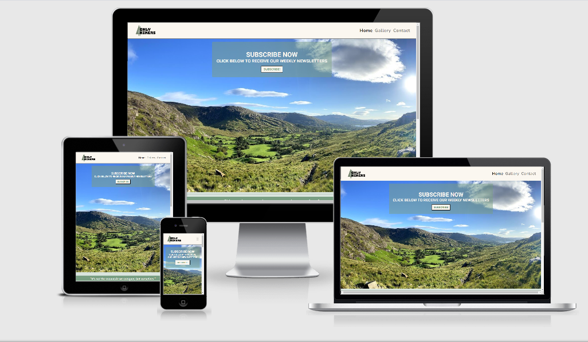
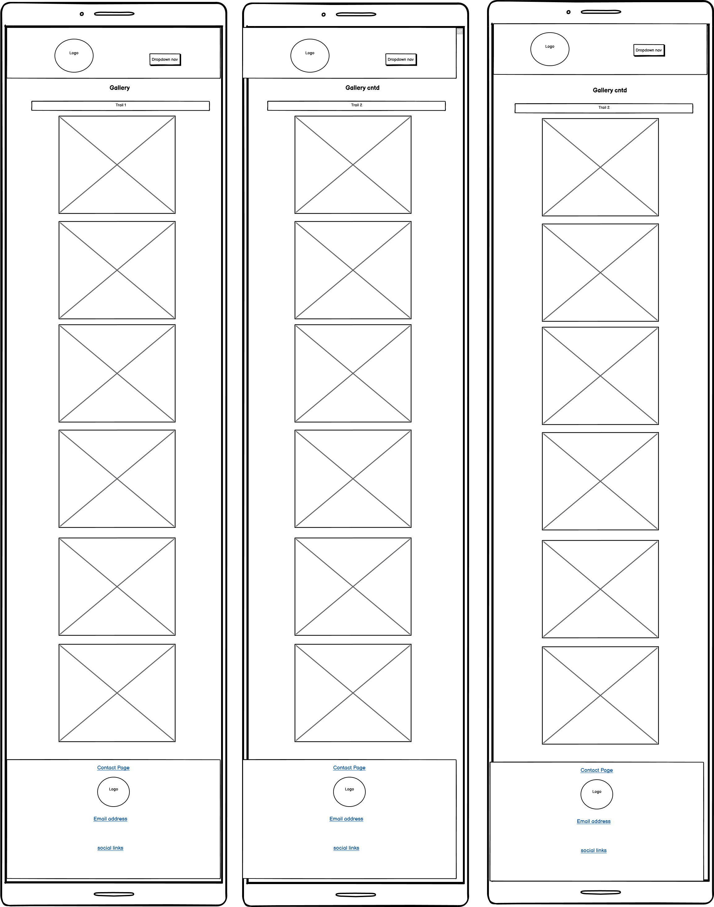
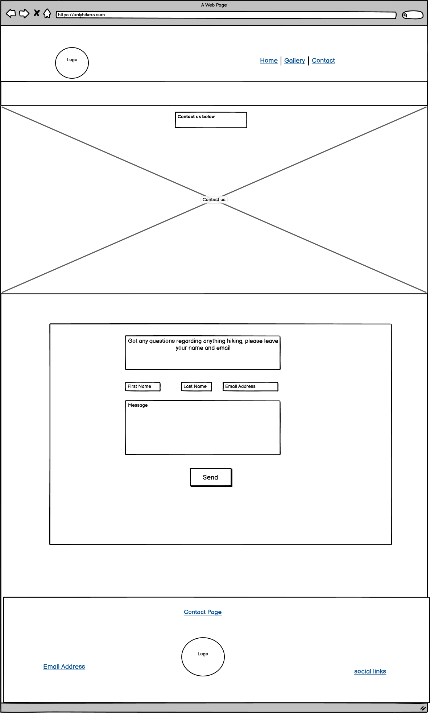

## Table of Contents :

* [Project Overview](#project-overview)
* [User Experience](#user-experience)
    * [User Stories](#user-stories)
    * [Design](#design)
        * [1. Font](#1-font)
        * [2. Color Scheme](#2-color-scheme)
        * [3. Logo](#3-logo)
        * [4. Wireframing](#4-wireframing)
* [Features](#features)
    * [Existing Features](#existing-features)
    * [Features Left to Implement](#features-left-to-implement)
* [Technology Used](#technology-used)
    * [Languages Used](#languages-used)
    * [Frameworks Libraries & Programs Used](#frameworks-libraries-and-programs-used)
* [Testing](#testing)
    - [Responsivity across devices](#responsivity-across-devices)
    - [HTML and CSS Validator Tests](#html-and-css-validator-tests)
    - [Test Cases](#test-cases)
        - [Header](#header)
        - [Footer](#footer)
        - [Home Page](#home-page)
        - [Gallery Page](#gallery-page)
        - [Contact Page](#contact-page)
    - [Lighthouse Tool](#lighthouse-tool)
 * [Issues and Solutions](#issues-and-solutions)   
* [Deployment](#deployment)
    * [Initial Creation](#initial-creation)
    * [Deployment via GitHub](#deployment-via-github)
    * [Local Deployment](#local-deployment)
* [Credits](#credits)
    * [Content](#content)
    * [Media](#media)
    * [Acknowledgements](#acknowledgements)
    

***

# Project Overview

##  Only Hikers     

***

A live verson of my site can be found <a href="https://shielh.github.io/Only-Hikers-MS1/">here</a>.

This milestone project has been my first ever solo coding project where I aimed to showcase the skills learnt thus far.
This project is a static front-end site built using HTML and CSS in conjunction with the Bootstrap Framework to create a responsive, mobile-first approach webpage.

Travel and hiking have always been two huge passions of mine so the idea for this project stemmed from that and the fact that I had so many 
amazing photos from 2020 of hikes in Ireland. I think a lot of people travel overseas to see beautiful parts of the world and we don't 
fully appreciate what we have on our doorstep.

My goal for this site is to spread the word about hiking in Ireland and hopefully inspire people to get out and experience it for themselves.

## Responsive site

Using the website <a href="http://ami.responsivedesign.is/">Am I Responsive</a>, I got the image that you see below displaying my websites home 
page across mobile, tablet and desktop.

 
## User Experience
 
#### User Stories

* As a user, I want a website that is easy to navigate so I can access all of the information without any challenges
* As a user who is new to hiking, I want to be able to find a contact form quickly in order to get in touch with any questions
* As a user who enjoys the great outdoors, I want lots of visually pleasing images that capture the beauty of Ireland
* As a user living in Ireland, I want ideas for my next hiking getaway 
* As a user who tends to use their mobile more than desktop, I want a webpage that is fully responsive across all devices 

## Design
### 1. Font
I used <a href="https://fontpair.co/">Font Pair</a> to choose the two main fonts for my website which are
 <a href="https://fonts.google.com/specimen/Roboto">'Roboto'</a> and <a href="https://fonts.google.com/specimen/Nunito"> 'Nunito'.</a>
 I'll use Roboto for the headings of the site and Nunito for the body, both of which are easy for the users to read.

### 2. Color Scheme
I used <a href="https://colorhunt.co/palette/">Color Hunt</a> to pick the colors for my website. I wanted to pick earthy tones to tie in with the concept of nature and hiking. 
The colors are as follows from top to bottom (as well as using #3f3f3c in some places where it provided more of a contrast than #555555):

 * #D9E4DD
 * #FBF7F0  
 * #CDC9C3
 * #555555

### 3. Logo

I used <a href="https://www.freelogodesign.org/">Free Logo Design</a> , a free website to make the logo for my website. 
I entered the name of the site, "Only Hikers", and then selected the "Environmental & Green" category which gave me a 
multitude of logos to choose from. I chose the logo that I found most visually pleasing and also one with a transparent 
background so it could fit into any header color of my choosing.

### 4. Wireframing

I used <a href="https://balsamiq.com/">Balsamiq</a> to create rough wireframes for my project in order to plan out the layout of the webpage on both desktop and mobile devices.
* Wireframes for Home Page. Alternatively you can view the wireframes here : [Home Page Desktop](assets/uxd/balsamiqWireframe/HomePageDesktop.png)
 and [Home Page Mobile](assets/uxd/balsamiqWireframe/HomePageMobile.png)

* Wireframes for Gallery Page. Alternatively you can view the wireframes here : [Gallery Page Desktop](assets/uxd/balsamiqWireframe/GalleryPageDesktop.png) 
and [Gallery Page Mobile](assets/uxd/balsamiqWireframe/GalleryPageMobile.png)

* Wireframes for Contact Page. Alternatively you can view the wireframes here : [Contact Page Desktop](assets/uxd/balsamiqWireframe/GalleryPageDesktop.png) 
and [Contact Page Mobile](assets/uxd/balsamiqWireframe/ContactPageMobile.png)

## Features
### Existing Features
#### Features found on all three:
* Headers are sticky across all pages and devices 
* Headers contain the site logo with an anchor tag to the home page and the navbar has anchor tags to their 
corresponding pages. 
* Headers on mobile devices contain the navbar in the form of a hamburger menu to use the screen space more efficiently.

See below the difference between desktop and mobile view:
 

 

 

* Footers across all devices contain the site logo with an anchor tag to the home page and a link to the contact page .
* On desktop view, social media icons are located on the right side of the footer and are linked to the relevant social media sites opening a new tab when clicked. 
* Footers also contains the address and phone number of the website located on the left of the footer on desktop view.
    - On mobile, all footer sections are stacked on top of eachother

See below the difference between desktop and mobile view:
 

 

#### Features unique to Home Page:
- Large hero-image spanning across entire width of the page with a "Subscribe" modal button inside a jumbotron
- Modal contains a form with a name input box, an email input box and a submit button
- A text area with a quote on hiking
- An image of the OnlyHikers page owners
- Text area with a brief introduction from the owners and details on what the page is about

#### Features unique to Gallery Page:
- 6 thumbnail images for 3 different hikes, making a total of 18 images
- On mobile devices, all 18 images appear vertically with one per row to make the image a better size for the viewer
- On mobile devices, there is an arrow at the bottom of the gallery to bring the user to the top of the page

#### Features unique to Contact Page:
- Large image under the navbar with text inside a jumbotron positioned inside
- Contact form with three different inputs, 'Name', 'Email Address' and 'Message' and a submit button underneath

 
### Features Left to Implement
- Events page where users can book into hikes (as spaces will be limited due to health and safety guidelines)
- Add more images to the gallery page and implement bootstraps carousel component 
- Introduce a blog page and enable commenting on blogs and gallery images to help connect users and open the site 
up for discussions
- Set up the Back End script so that the subscription modal and contact form information is processed

## Technology Used

### Languages Used

- [HTML5](https://en.wikipedia.org/wiki/HTML5) - I used HTML as the main language for structuring the content
- [CSS3](https://en.wikipedia.org/wiki/CSS) - I used CSS as the primary language for styling the sites content

### Frameworks Libraries and Programs Used
- [GitHub](https://github.com/)  
This is the hosting site where I first created the repository for this webpage and also where the live site is deployed from 
- [Git](https://git-scm.com/)  
This is the version control software used where can I commit and push the updated information to the hosting website GitHub
- [Bootstrap](https://getbootstrap.com/)  
I used Bootstrap to help in the design and layout of the website in conjunction with HTML and CSS
- [Font Awesome](https://fontawesome.com/)  
I used the icons from this site for the social media icons in the footer and the arrow at the bottom of the 
gallery page
- [Balsamiq](https://balsamiq.com/)  
I used this to create my rough wireframes
- [Google Fonts](https://fonts.google.com/)  
I used Google Fonts to import my two fonts for this site, Roboto and Nunito
- [Color Hunt](https://colorhunt.co/) 
I found the palette of colours I used here
- [Free Logo Design](https://www.freelogodesign.org/)  
I created my free logo here 
- [Font Pair](https://fontpair.co/)  
I chose my two complementary fonts here
- [Tiny JPG](https://tinyjpg.com/)  
I used this to compress my images
- [Paint 3D](https://www.microsoft.com/en-us/p/paint-3d/9nblggh5fv99?activetab=pivot:overviewtab)  
I used this progran to crop my site logo while still maintaing the clear background
- [Rapid Tables](https://www.rapidtables.com/convert/color/hex-to-rgb.html)
I used this to convert my dark green colour to rgb to use for the slightly transparent jumbotron and contact form background
- [Reverso](https://www.reverso.net/spell-checker/english-spelling-grammar/)
I used this to check the spelling and grammar of my README.md file

## Testing

The aim of this testing section is to:
* Ensure that my site is fully responsive across all devices ranging from mobile (<576px) to large desktop screens (>1200px) and across different browsers including Chrome, Safari, Mozilla and Opera.  
* Perform tests on the HTML and CSS code through their respective validators. 
* Test Cases
    - Header
    - Footer
    - Home Page
    - Gallery Page
    - Contact Page
* Run DevTools Lighthouse report

*** 

### Responsivity across devices
- I checked the site across [Google Chrome](https://www.google.com/intl/en_ie/chrome/), [Mozilla Firefox](https://www.mozilla.org/en-US/firefox/new/), [Safari](https://www.apple.com/safari/) 
and [Opera](https://www.opera.com/) and all pages were completely responsive  with the layout remaining intact.
- Using [Chrome DevTools](https://developers.google.com/web/tools/chrome-devtools), (to open I right-clicked anywhere on my website and clicked "Inspect"), I ran my site in mobile/tablet display 
across the following devices: Galaxy Note 3, Galaxy S III, Moto G4, iPhone 4, Galaxy S5, Pixel 2, Pixel 2 XL, iPhone 5/SE, iPhone 6/7/8, iPhone 6/7/8 Plus, iPhone X, iPad, iPad Pro. Everything 
ran normally on these devices. I also sent my site to some friends and family to open on their phones and nobody had any issues.

***
 
### HTML and CSS Validator Tests
1. W3C HTML Validator
- I opened [W3C HTML Validator](https://validator.w3.org/) and selected the "Validate by Direct Input" option and pasted index.html, gallery.html and contact.html all in separately.
- All pages initally came up with the following errors:

- I removed the h5 elements as a child element of the label. I removed p-0 from the inline style for h4. I removed the space between the "tel:" and the "555" and finally I matched the aria-describedly 
with its appropriate ID element. 
- I ran the code through [W3C HTML Validator](https://validator.w3.org/) again and got the following message "Document checking completed. No errors or warnings to show."
    
    

2. Similarly, I ran the code through the [W3C CSS Validator](https://jigsaw.w3.org/css-validator/) 
- I selected the "by Direct Input" option and pasted my style.css code in
- I received the message "Congratulations! No Error Found." 

***

### Test Cases

#### Header
* Navbar
    - Located at the top of the screen on all devices
    - Sticky navigation bar across all devices
    - Menu items are "Home", "Gallery" and "Contact"
    - Each menu item links to the respective page when clicked
    - In the mobile view, the menu items collapse into a hamburger icon

* Site logo 
    - Found both at the top left of the navbar and in the center of the footer at the bottom of each of the three pages
    - Click on the logo on and it redirects to index.html page or refreshes the page if currently on index.html
    - Hover over the logo and note the change in size. The logo gets bigger when you hover over it 

#### Footer
- Located on the bottom of the screen
- Broken into three sections across the desktop layout with the address and phone number on the left, the "Contact us" link and site logo in the middle and the social links on the right
- All sections stacked in one column in mobile layout
- "Contact Us" link 
    - Visible in the footer across mobile and desktop
    - Click it and it redirects you to contact.html (except when clicked from contact.html in which case it will refresh the page)
- Site logo (as per above)
- Phone number link
    - Visible in the footer across mobile and desktop 
    - Click the phone number and it will promt you to pick and application to make the call on 
- Social Media links
    - Visible in the footer across mobile and desktop
    - Click each icon on each of the three pages
    - Note when you hover over each icon, they get bigger
    - Social media sites open in a new tab
    - Each social icon brings you to the correct social media site

#### Home Page
* Contains a header and a footer
* Contains a hero image with a jumbotron and a modal button
* Check modal component
    - Go to to index.html page
    - Click the "SUBSCRIBE!" button
    - Attempt to submit the empty form to confirm that an error message appears for the empty input box
    - Attempt to submit the form using an email missing the "@" symbol to confirm an error message appears requesting you include the "@" symbol
    - Attempt to sumbit the form with all inputs correctly filled in to confirm page reloads once submitted
* Contains a quote container underneath the hero image
* Contains an image to the left with "About Us" text to the right 
    - In mobile view the image is displayed beneath the quote and the "About Us" text beneath the image
* "contact us" in "ABOUT US" section
    - Go to index.html page
    - Scroll to "ABOUT US" section
    - Click the "contact us" text with a heavier font-weight than the surrounding text
    - Note the colour change when you hover over it from #FBF7F0 to #799e82
    - It will redirect you to the contact.html page
* "gallery" in "ABOUT US" section
    - Go to index.html page
    - Scroll to "ABOUT US" section
    - Click the "gallery" text with a heavier font-weight than the surrounding text
    - Note the colour change when you hover over it from #FBF7F0 to #799e82
    - It will redirect you to the gallery.html page

#### Gallery Page
* Contains a header and footer
* Contains 18 images split into three sections with each section relating to a certain hike
* In desktop view, the images are organised into 3 per row
    - In mobile view, the images are staked in a single column
    - In mobile view, there is an arrow pointing up above the footer linking to the top of the page

***
 
#### Contact Page
* Contains a header and footer
* Contains an image with a jumbotron containing text
* Check the contact form: 
    - Go to the contact.html page
    - Attempt to submit the empty form to confirm that an error message appears for the empty input box
    - Attempt to submit the form using an email missing the "@" symbol to confirm an error message appears requesting you include the "@" symbol
    - Attempt to sumbit the form with all inputs correctly filled in to confirm page reloads once submitted

***

### Lighthouse Tool
 
In Lighthouse, scores from 90-100(green) are considered good, scores from 50-89(orange) needs improvement and below 50(red) are considered poor. 

* On desktops:
    - Open each page, right-click and click "Inspect"
    - Click "Lighthouse" on the top right of the DevTools navbar
    - Ensure "Desktop" is ticked and click "Generate Report"
        - index.html: Scored 97 in "Performance", 94 in "Accessibility" and 100 in "Best Practises"
        - gallery.html: Scored 98 in "Performance", 97 in "Accessibility" and 100 in "Best Practises"
        - contact.html: Scored 99 in "Performance", 96 in "Accessibility" and 100 in "Best Practises"
* On mobile devices:
    - Open each page, right-click and click "Inspect"
    - Click "Lighthouse" on the top right of the DevTools navbar
    - Ensure "Mobile" is ticked and click "Generate Report"
        - index.html: Scored 83 in "Performance", 95 in "Accessibility" and 93 in "Best Practises"
        - gallery.html: Scored 95 in "Performance", 95 in "Accessibility" and 93 in "Best Practises"
        - contact.html: Scored 90 in "Performance", 96 in "Accessibility" and 93 in "Best Practises"

***

## Issues and Solutions
* My index.html Lighthouse score for performace was 83 which falls in the "needs improvement" category. I tried compressing the hero image further to 
help reduce the "Lowest Contentful Paint" time but it didn't make much of a difference. I tried resizing the image to have a mobile version and then 
used a media query to have a larger version of the image for desktop view. Again, this didn't make much of a difference however it did move the score up 
from 72 to 83. I made the decision to not waste any more time on this issue and to leave as is and to make note for future reference.
* Throughout the development, I came across a bug where lots of Pinterest icons were hidden in the background of the footer making the height of the 
footer much larger than it needed to be. I discover there was an unclosed "a tag" which was causing this issue.
* Another issue I faced was deviating from my original wireframes. You can see the original wireframes [here](assets/uxd/balsamiqWireframe/oldWireframes). I ended up adding a hero image 
and rejigging the layout of the site. I think because it was my first webpage I needed to play around with the layout a little before deciding on a concrete look for the website. I can 
see going forward though the benefits of having a set wireframe before starting any coding to save time.
* When styling my navbar the hamburger icon disappeared. The area was still functioning when I clicked it i.e. the dropdown menu was still working but I just couldn't see the icon. I realised this 
was due to me changing the style of the already predefined style that comes with "navbar-light". I had the option of using a Font Awesome icon and styling it in style.css or keep the navbar-light 
style. I opted to keep the navbar-light settings as it tied in well with my sites colour scheme any way.

## Deployment
### Initial Creation
Only Hikers was first created by completing the following steps on GitHub:
1. Open [Github](https://github.com/) page up in browser
2. Log in using your username and password
3. Click the "New" green button to the left-hand side repository section
4. Click template dropdown menu and select the "Code Institute Full Template"
5. Enter name of project "Only-Hikers-MS1"
6. Click "Create repository"
7. Click the green "Gitpod" button ONCE to redirect to the Gitpod workspace
8. Open via [Gitpod Workspaces](https://gitpod.io/workspaces/) only from then on

Throughout development, three primary commands were used with the CLI [Git](https://git-scm.com/) and were as follows :

- "git add" followed by the file name you wish to stage or "git add ." stages all unstaged files
- "git commit -m" followed by a detailed comprehensive comment pertaining to the changes made since the previous commit
- "git push" makes all changes visible on the GitHub Repo

### Deployment via GitHub
1. Open [Github](https://github.com/) page up in browser
2. Log in using your username and password
3. Select "shielh/Only-Hikers-MS1" from repositories displayed on left-hand side of screen
4. Click "settings", the last option displayed in the navigation menu
5. Scroll down until you reach "GitHub Pages" section
6. Select "Master Branch" in the dropdown under the Source heading
7. Finally, click to confirm my selection
8. A live version of Only Hikers is now live on Github [here](https://shielh.github.io/Only-Hikers-MS1/)

### Local Deployment
1. Open up "shielh/Only-Hikers-MS1 on GitHub as previously described in steps 1-3 above
2. Click the "Code" button with the download icon beside it (beside the green GitPod button) 
3. Copy the url visible underneath "https://github.com/shielh/Only-Hikers-MS1.git"
4. Using your preferred IDE, type the command "git clone" followed by the above url
5. A clone of your project will be created on your device 
6. Open the clone folder

## Credits

### Content
- The text for the quote section was taken from  [The Globe Trotter](https://thesologlobetrotter.com/hiking-quotes/)
- The CSS styling for the hero image and the image on the contact page was taken from [Laura Lee Flores Blog](https://www.lauraleeflores.com/blog/header-image-sizing-guide)
- The modal component on the home page and the form section were both taken from [Bootstrap's Components](https://getbootstrap.com/docs/4.5/components/modal/)
- I used [Stack Overflow](https://stackoverflow.com/questions/37814508/order-columns-through-bootstrap4) to learn about how to order columns differently across various devices
- I got inspiration from [CSS Tricks](https://css-tricks.com/examples/hrs/) on how to style my horizontal rule 
- I watched this [Youtube Video](https://www.youtube.com/watch?v=V_lAhqLXT9A) to brush up on everything I had learnt about combining HTML, CSS and Bootstrap to create a fully responsive website

### Media
- I took all the images used across this webpage so I didn't need to obtain permissions from anyone

### Acknowledgements

- A big thank you to my mentor Rohit Sharma for his help and guidance throughout my first project
- Thanks to everyone in the Slack community especially my September onboarding channel where my peers were always quick to respond to any questions I had
- Thanks to my sister for going on all these hikes with me throughout this crazy pandemic year

